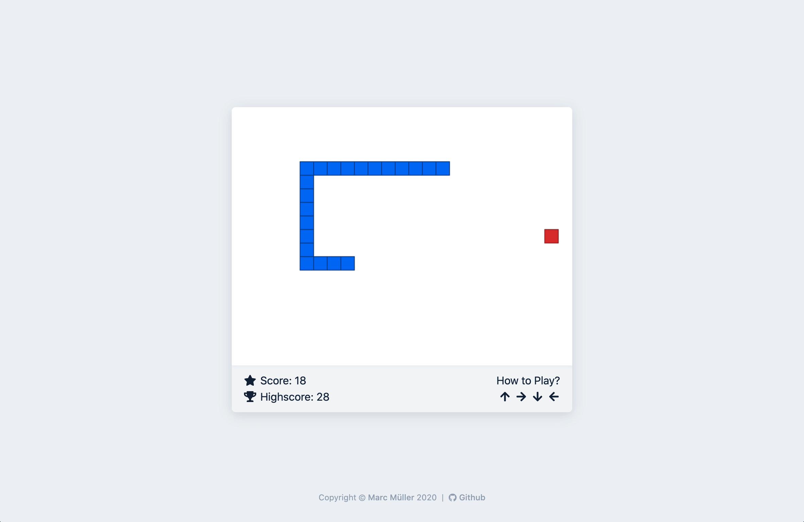

## What is Next-Snake?

Next-Snake is a minimalistic Snake browser game, built using Next.js and React.\
I challenge you to beat a score of 30! [Give it a shot!](https://next-snake.vercel.app/)

## Why Next.js and React?

Instead of having vanilla JavaScript intervals running the game, React offers the `useState` and `useEffect` hooks for updating the canvas. Additionally, React hooks enable the custom [`setInterval` declarative](https://github.com/donavon/use-interval) as described by [Dan Abramaov](https://github.com/gaearon) on his [personal blog](https://overreacted.io/making-setinterval-declarative-with-react-hooks/).

The `setInterval` declarative makes it possible to pause the interval and dynamically change the speed at which the interval runs. This makes it easy to implement game mechanics such as the snake speeding up as the player collects points.

This project was a great opportunity to gain a deeper understanding of how React hooks work, and how data is read and updated within a React frontend. Next.js made it easy for the project to get legs, as there was no time spent worrying about routing and SCSS support. Additionally, hosting the project on Vercel made Next.js the obvious option when developing with React.

## Contributing

If you happen to find any bugs; have ideas on improving core gameplay; or you want to contribute directly, feel free to open an issue or pull request!
